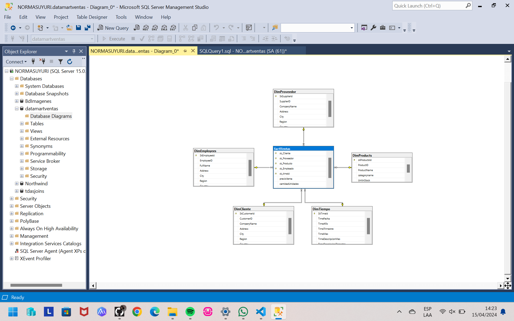

# DOCUMENTACION
UTILIZAMOS LAS BD DE Norhwind :
```
Create database datamartventas;
use datamartventas;

--hacer la primera dimension de estrella
--a dim  productos se le va a poner skproductio () y bkproducto (business key es el id del producto)
 drop table Employees;
CREATE TABLE [dbo].[DimProducts](
	skProductoId int not null identity(1,1) primary key,
	[ProductID] [int]  NOT NULL,
	[ProductName] [varchar](40) NULL,
	[categoryname] nvarchar(15) not null,
	[UnitinStock] [smallint] NULL,
)
go

CREATE TABLE [dbo].[DimEmployees](
	SkEmployeeId int not null identity(1,1) primary key,
	[EmployeeID] [int]  NOT NULL,
	FullName nvarchar(50) not null,
	[Address] [nvarchar](60) NULL,
	[City] [nvarchar](15) NULL,
	[Region] [nvarchar](15) NULL,
	[Country] [nvarchar](15) NULL
	)

CREATE TABLE [dbo].[DimCliente](
	SkCustomerId int not null identity(1,1) primary key,
	[CustomerID] [nchar](5) NOT NULL,
	[CompanyName] [nvarchar](40) NOT NULL,
	[Address] [nvarchar](60) NULL,
	[City] [nvarchar](15) NULL,
	[Region] [nvarchar](15) NULL,
	[Country] [nvarchar](15) NULL,
	)

CREATE TABLE [dbo].[DimProveedor](
	SkSupplierId int not null identity(1,1) primary key,
	[SupplierID] [int] NOT NULL,
	[CompanyName] [nvarchar](40) NOT NULL,
	[Address] [nvarchar](60) NULL,
	[City] [nvarchar](15) NULL,
	[Region] [nvarchar](15) NULL,
	[Country] [nvarchar](15) NULL,
	)

CREATE TABLE [dbo].[DimTiempo](
	SkTimeId int not null identity(1,1) primary key,
	TimeFecha date not null,
	TimeAño int not null,
	TimeTrimestre int not null,
	TimeMes int not null,
	TimeDescripcionMes nvarchar(20) not null,
	TimeDescripcionTrimestre nvarchar(20) not null,
	)

CREATE TABLE  factVentas(
sk_Cliente int not null,
sk_Proveedor int not null,
sk_Producto int not null,
sk_Empleado int not null,
sk_timeid int not null,
precioVenta money not null,
cantidadUnidades int not null,
importe money not null

constraint pk_fact_ventas primary key(sk_Cliente,sk_Proveedor,sk_Producto,sk_Empleado,sk_TimeId),
constraint fk_fact_cliente foreign key (sk_Cliente) references DimCliente,
constraint fk_fact_proveedor foreign key (sk_Proveedor) references DimProveedor,
constraint fk_fact_producto foreign key (sk_Producto) references DimProducts,
constraint fk_fact_empleado foreign key (sk_Empleado) references DimEmployees,
constraint fk_fact_timeid foreign key (sk_TimeId) references DimTiempo,
)

	select year(getdate())
	select quarter(getdate())

insert into datamartventas.dbo.DimProducts
select p.productId, p.productName,c.CategoryName,p.UnitsInStock 
from Northwind.dbo.Products as p
inner join (select categoryId,categoryname from northwind.dbo.Categories) as c
on p.CategoryID=c.CategoryID


insert into datamartventas.dbo.DimCliente
select CustomerID,CompanyName,Address,City,case when Region is null then 'sin región' else Region end as Region,Country from Northwind.dbo.Customers

drop table factVentas2
CREATE TABLE  factVentas2(
sk_Cliente int not null identity(1,1) primary key,
precioVenta money not null,
cantidadUnidades int not null,
importe money not null
)

select UnitPrice,Quantity, (UnitPrice*Quantity)as importe from Northwind.dbo.[Order Details] 

```
### EL DIAGRAMA SE VISUALIZARA DE LA SIGUIENTE MANERA 

;

# SE LLENA EL DATAWERHAOSE MEDIANTE UN ETL EN SSIS
Esta es la arquitectura:
Del lado izquierdo esta la entrada  de Northwind y del lado derecho esta la entrada de la dim product
en medio hace el analisis en caso de que se encuentren nuevos datos , pasa a la salida  de DIMProductos:


Hace la coneccion a notwind  y ingresamos el select como se muestra en la  imagen:


Es la coneccion al modelo dimenciones (dim prodructos):

Se muestra la salida  de la tabla (dimproductos)


###clientes

Se muestra el comportamiento del flujo :

 imagen2.Entrada de Northwind
 
imagen3.Se muestra la entrada de datamark venta 

imagen4. salida de de las dos bases de datos 


###Proveedores
esquema  de provedores 

imagen1.Entrada de la base de datos 

imgen2.Datos dimProveedor

imgen 3.salida para guardar los datos en la tabla


###General de Employed
empleados:


ingreso de datos de la conexión con northwnd


el ingreso de la tabla empleados


salida de datos nuevos, del proceso de empleados


# CONTADOR DE SECUENCIA


solo modulariza


## CONTENEDOR DE SECUENCIA 


FLUJO FINAL :

 PARTE 1:
 
 PARTE 2:
 
 PARTE 4:

se hace la implementacion 


 
 # AUTOMATIZACION EN UN JOB DE SQLSERVER
realizamos la siguiente configuracion 
 
 Aceptamos las siguientes configuraciones como se muestran las imagenes :
 
 

 damos aceptar
 
 damos next

 
 escoger implementar
 

 se a implementado correctamente
 
hubicamos  la carpeta de integration services, hubicamos la carpeta llenar 2 que es como la llamamos, abrimos la carpeta abrimos proyecto abrimos paquetes, y hubicamos llenada-DW

seleccionamos  y ejecutamos


seleccionmos OK

seleccionamos si


resultaado


reporte

reporte lleno 

 
 
 
 
 Colocamos el nombre del jop 
 
 
 pasamos a Steps y seleccionamos new steps

 

 colocamos nombre y cambiamos a integration services

 

 entranos en la carpeta, seleccionamos la carpeta que hicimos, y seleccionamos la que es del llenado

 

 damos ok
 

 seleccionamos ok 
  

  seleccionamos schedules

  
  aquí modificamos los días que quiero que se generen nuestros reportes
  
una vez hecho solo ejecutamos lo siguiente


carga


visualizacion final 


